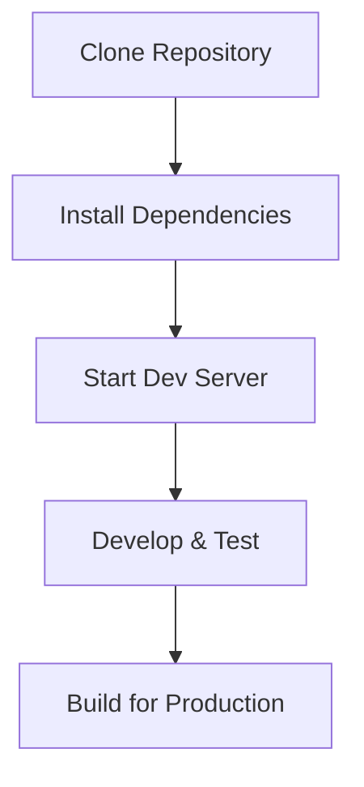
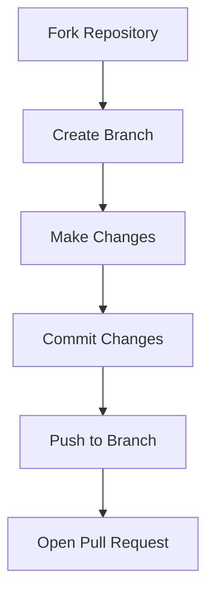

<p align="center">
  
   
  
</p>

<h1 align="center">React Vite Template</h1>
<p align="center">
🚀 Modern React Template: 2024-Ready and Pre-Configured! 🚀
</p>
<br>
<p align="center">
<a href="https://deepumandal.github.io/vite-template/"><b>Live!</b></a>
</p>
<p align="center">
<a href="https://https://github.com/deepumandal/vite-template/blob/master/README.md">📖 Documentation </a> |
<a href="https://github.com/deepumandal/vite-template?tab=readme-ov-file#get-started">🚀 Getting Started</a> |
<a href="https://discord.gg/deepumandal" title="Discord invite">🙌 Join Us</a>
</p>

<div align="center">
    
    
    
    
    
    
    
    
    
    
</div>

# Objective

This template is designed to supercharge your frontend development experience by providing a pre-configured setup that reduces the repetitive tasks you often face when starting a new project. Whether you're a seasoned developer or just getting started, this template has everything you need to kickstart your next project with minimal hassle.

# Table of Contents

1. [Introduction](#introduction)
2. [Key Features](#key-features)
3. [Why Vite Template?](#why-vite-template)
4. [Getting Started](#getting-started)
5. [Project Structure](#project-structure)
6. [Development Workflow](#development-workflow)
7. [Built-in Tools](#built-in-tools)
8. [Configuration](#configuration)
9. [Pros and Cons](#pros-and-cons)
10. [Contribution Guidelines](#contribution-guidelines)
11. [Flowcharts](#flowcharts)
12. [FAQ](#faq)
13. [License](#license)

## Introduction

Welcome to the **Vite Template** project! 🚀

This Vite template aims to streamline the process of setting up a new frontend project. With modern tools and best practices built-in, you can focus more on developing your application and less on configuring your environment.

## Key Features

### ⚡ Vite + React + TypeScript

- **Fast Build System:** Leverage the speed of Vite with the flexibility of React and TypeScript.
- **Hot Module Replacement (HMR):** Instant updates during development for a seamless experience.

### 🎨 Pre-Built UI Components

- **TailwindCSS Integration:** Responsive, utility-first CSS framework for rapid UI development.
- **Pre-Configured Components:** A set of reusable UI components to get you started quickly.
- **Custom Color Palette:** Easily adjustable to match your brand or project theme.

### 🛠️ Developer Tools

- **Husky:** Pre-commit hooks to ensure code quality.
- **Prettier + ESLint:** Automated code formatting and linting for a consistent codebase.
- **YAML Workflows:** Pre-configured GitHub Actions for CI/CD pipelines.
- **Redux Integration:** State management with minimal setup.

### 📚 Documentation

- **Comprehensive Docs:** In-depth documentation to guide you through the setup and usage.
- **Modern Design:** User-friendly and easy-to-navigate documentation structure.

## Why Vite Template?

### Problem

Starting a new React application often involves repetitive tasks such as setting up Vite, configuring linting rules, integrating Tailwind CSS, building UI components, setting up lint-staged, and more. These steps can be time-consuming and prone to errors, slowing down your development process.

### Solution

This Vite template is designed to supercharge your frontend development experience by providing a pre-configured setup that reduces these repetitive tasks. It includes the latest tech stacks and configurations, ensuring you have everything you need to kickstart your next project with minimal hassle:

- **ESLint**: Pre-configured linting rules to maintain code quality.
- **Prettier**: Code formatting setup to ensure consistency across your codebase.
- **Husky**: Pre-commit hooks to run tasks such as linting and tests before committing code.
- **Predefined UI Components**: A set of reusable UI components to accelerate your development.

### Impact

Adopting this Vite template brings several significant benefits

- **Enhanced Developer Experience:** Spend less time on setup and more time on building features, thanks to the pre-configured setup.
- **Improved Productivity:** With essential tools and configurations already in place, you can quickly start coding without worrying about the boilerplate setup.
- **Consistency and Quality:** Pre-configured linting and formatting tools ensure a consistent and high-quality codebase.
- **Future-Proof:** The template includes the latest best practices and technologies, keeping your project up-to-date with minimal effort.

Whether you're a seasoned developer or just getting started, this Vite template provides a robust foundation for your project, allowing you to focus on what matters most: building amazing applications

## Getting Started

### Prerequisites

- Node.js (version 14.0.0 or higher)
- npm or yarn or pnpm

> **Note:** This is suggested use pnpm over npm and yarn.

### Installation

1. **Use this Template:**

   - click on use this template

1. **Clone the repository:**

   ```sh
   git clone https://github.com/your-username/vite-template.git
   cd vite-template
   ```

1. **Install dependencies:**

   ```sh
   npm install
   # or
   yarn install
   # or
   pnpm install
   ```

1. **Start the development server:**
   ```sh
   npm run dev
   # or
   yarn dev
   # or
   pnpm install
   ```

## Project Structure

```plaintext
📂 .github                             # GitHub actions and CI/CD pipelines
└── 📂 workflows
    └── 📄 codeql.yml                  # Configuration for GitHub CodeQL analysis
📂 .husky
└── 📄 pre-commit                      # Husky pre-commit hook script
📂 docs                                # Documentation files for the template
📂 public                              # Publicly accessible static files
📂 src                                 # Source folder
├── 📂 @types                          # TypeScript type definitions
├── 📂 assets                          # Static assets
│   ├── 📂 fonts                       # Custom font files
│   ├── 📂 styles                      # All CSS files for components
│   └── 📂 svg                         # SVG media files
├── 📂 components                      # components
│   ├── 📂 HOC                         # Higher-Order Components
│   ├── 📂 config                      # Configuration for components
│   │   ├── 📂 ui                      # UI component configurations
│   │   └── 📄 index.ts                # Entry point for config
│   ├── 📂 hooks                       # Custom React hooks
│   │   ├── 📂 useTheme                # Hook for theme management
│   │   └── 📄 index.ts                # Entry point for hooks
│   ├── 📂 shared                      # Shared components and utilities
│   │   ├── 📂 Form                    # Form component files
│   │   ├── 📂 Label                   # Label component files
│   │   └── 📄 index.ts                # Entry point for shared components
│   ├── 📂 ui                          # UI components
│   │   ├── 📂 Accordion               # Accordion component files
│   │   ├── 📂 Avatar                  # Avatar component files
│   │   ├── 📂 Badge                   # Badge component files
│   │   ├── 📂 Block                   # Block component files
│   │   ├── 📂 Breadcrumb              # Breadcrumb component files
│   │   ├── 📂 Button                  # Button component files
│   │   ├── 📂 CheckBox                # CheckBox component files
│   │   ├── 📂 Common                  # Common UI components
│   │   ├── 📂 ConfirmationDialog      # Confirmation Dialog component files
│   │   ├── 📂 Container               # Container component files
│   │   ├── 📂 ContextMenu             # Context Menu component files
│   │   ├── 📂 DropDownMenu            # DropDown Menu component files
│   │   ├── 📂 Flex                    # Flex component files
│   │   ├── 📂 Grid                    # Grid component files
│   │   ├── 📂 HoverCard               # HoverCard component files
│   │   ├── 📂 Model                   # Model component files
│   │   ├── 📂 Separator               # Separator component files
│   │   ├── 📂 Skeleton                # Skeleton component files
│   │   ├── 📂 ToolTip                 # ToolTip component files
│   │   ├── 📂 Typography              # Typography component files
│   │   └── 📄 index.ts                # Entry point for UI components
├── 📂 utils                          # Utility functions and helpers
│   └── 📂 className                  # Utility functions for class names
├── 📄 App.tsx                        # Main application component
├── 📄 main.tsx                       # Entry point of the application
├── 📄 tailwind.css                   # Tailwind CSS configuration
└── 📄 vite-env.d.ts                  # TypeScript environment definitions for Vite
📄 .eslintignore                      # List of files and directories ignored by ESLint
📄 .eslintrc.cjs                      # ESLint configuration file
📄 .gitignore                         # List of files and directories ignored by Git
📄 LICENCE.md                         # License information
📄 README.md                          # Main README file with project overview
📄 SECURITY.md                        # Security policies and guidelines
📄 cspell.json                        # Configuration for cspell (spell checker)
📄 index.html                         # Main HTML file for the application
📄 package.json                       # Project dependencies and scripts
📄 pnpm-lock.yaml                     # Lockfile for pnpm package manager
📄 postcss.config.js                  # PostCSS configuration
📄 tailwind.config.js                 # Tailwind CSS configuration
📄 tsconfig.json                      # TypeScript configuration
📄 tsconfig.node.json                 # TypeScript configuration for Node.js
📄 vite.config.ts                     # Vite configuration file


```

> Here is the basic overview of folder structure.

## Development Workflow

### Commands

- **Start Development Server**:

  - `npm run start`
  - `yarn start`
  - `pnpm start`

- **Build for Production**:

  - `npm run build`
  - `yarn build`
  - `pnpm build`

- **Lint Code**:

  - `npm run lint`
  - `yarn lint`
  - `pnpm lint`

- **Format Code**:

  - `npm run prettier:write`
  - `yarn prettier:write`
  - `pnpm prettier:write`

- **Check Types**:

  - `npm run check-types`
  - `yarn check-types`
  - `pnpm check-types`

- **Spell Check**:
  - `npm run spellcheck`
  - `yarn spellcheck`
  - `pnpm spellcheck`

### Recommended Extensions

#### VSCode Extensions:

- **ESLint**
- **Prettier - Code formatter**
- **TailwindCSS**

## Built with Tools

| TypeScript | React | React Hook Form | Radix UI | clsx |
|------------|-------|-----------------|----------|------|
|  |  |  |  |  |

| Lucide React | Prettier | Tailwind CSS | React DOM | Zod |
|--------------|----------|--------------|-----------|-----|
|  |  |  |  |  |

| cspell | Vite | ESLint | Husky | ts-node |
|--------|------|--------|-------|---------|
|  |  |  |  |  |


## Contribution Guidelines

We welcome contributions from the community. Please follow these steps to contribute:

1. Fork the repository and clone your fork.
2. Create a new branch: `git checkout -b my-feature`
3. Make your changes and commit them: `git commit -m 'Add some feature`
4. Push to the branch:`git push origin my-feature`
5. Open a pull request.

## Flowcharts

### Development Workflow



### Contribution Process



## FAQ

### Why use Vite over traditional build tools like Webpack?

Vite offers a faster development experience due to its instant server start and fast HMR, leveraging native ES modules.

### Can I use this template with TypeScript?

Yes, TypeScript support is built-in. You can easily switch to TypeScript by renaming your files to `.ts` and `.tsx`.

### How do I add a new dependency?

You can add a new dependency using npm or yarn:

```sh
npm install <dependency-name>
# or
yarn add <dependency-name>
```

### How do I customize the ESLint or Prettier configuration?

You can modify the configuration files `.eslintrc.js` to fit your preferences.

## License

This project is licensed under the MIT License. See the [LICENSE](./LICENSE.md) file for more details.

Thank you for using our Vite template! If you have any questions or feedback, feel free to open an issue or contribute to the project. Happy coding! 🚀
