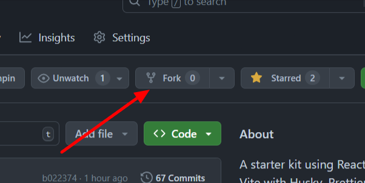
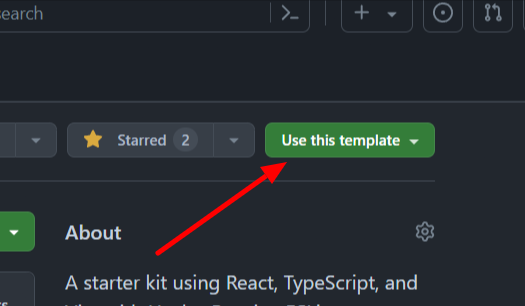
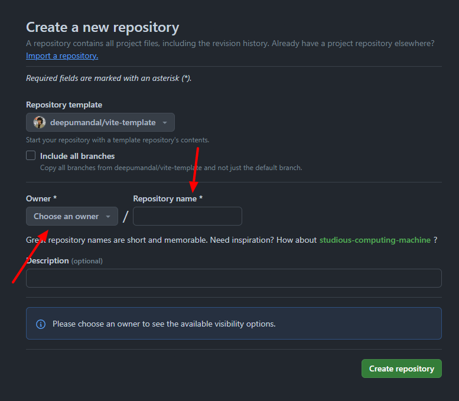

<p gap="40" align="center">
  
  
   
  
  
</p>

<h3 align="center">React + Vite + Template</h3>

<p align="center">
  If you're looking for a <b>modern</b>, <b>2024-ready</b> React-based template with all the essential  tools and technologies pre-configured, you're in the right place.
</p>

<p align="center">
  
  
  
  
  
</p>

### 🚀 Introduction

Welcome to this **Vite template** repository! If you're looking for a modern, 2024-ready React-based template with all the essential tools and technologies pre-configured, you're in the right place.

### 🛠️ Features

- **React + TypeScript**: Robust and scalable web setup.
- **Vite**: Fast build tool.
- **Code Quality Tools**: Ensure clean and maintainable code with:
  - **Husky**: Enforce consistent commit messages.
  - **Prettier**: Automatically format your code.
  - **ESLint**: Catch and fix common errors.
- **TailwindCSS**: Utility-first CSS framework.
- **Redux**: State management.
- **Prebuilt UI Components**: Ready-to-use components to speed up development.

### 📦 Getting Started

#### Prerequisites

Ensure you have the following installed:

- Node.js (>=20.x)
- pnpm (>=6.x)

#### Installation

1. **Fork the Repository**: This will create a copy of this repository under your GitHub account.
   

2. **Use This Template**: Navigate to your forked repository and click on **Use this template**.
   

3. **Create a New Repository**: Follow the prompts to create a new repository from the template.
   

4. **Clone the Repository**: Clone the newly created repository to your local machine.
   

   ```sh
   git clone https://github.com/your-repo/my-project-template.git
   cd my-project-template
   ```

<!-- @import "[TOC]" {cmd="toc" depthFrom=1 depthTo=6 orderedList=false} -->

<!-- @import "[TOC]" {cmd="toc" depthFrom=1 depthTo=6 orderedList=false} -->

<!-- code_chunk_output -->

- [🚀 Introduction](#-introduction)
- [🛠️ Features](#️-features)
- [📦 Getting Started](#-getting-started)
  - [Prerequisites](#prerequisites)
  - [Installation](#installation)

<!-- /code_chunk_output -->
