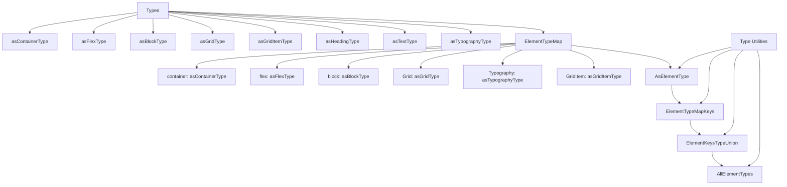

```mermaid
graph TD
    A[Types]
    A1[asContainerType]
    A2[asFlexType]
    A3[asBlockType]
    A4[asGridType]
    A5[asGridItemType]
    A6[asHeadingType]
    A7[asTextType]
    A8[asTypographyType]
    B[ElementTypeMap]
    B1[container: asContainerType]
    B2[flex: asFlexType]
    B3[block: asBlockType]
    B4[Grid: asGridType]
    B5[Typography: asTypographyType]
    B6[GridItem: asGridItemType]
    C[Type Utilities]
    C1[AsElementType<T>]
    C2[ElementTypeMapKeys]
    C3[ElementKeysTypeUnion]
    C4[AllElementTypes]

    A --> A1
    A --> A2
    A --> A3
    A --> A4
    A --> A5
    A --> A6
    A --> A7
    A --> A8

    B --> B1
    B --> B2
    B --> B3
    B --> B4
    B --> B5
    B --> B6

    C --> C1
    C --> C2
    C --> C3
    C --> C4

    A --> B
    B --> C1
    C1 --> C2
    C2 --> C3
    C3 --> C4
```
